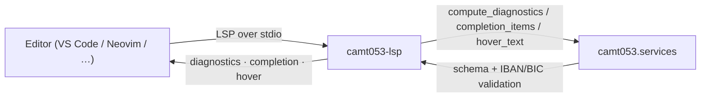

# camt053-lsp: A Language Server for Authoring ISO 20022 Reversing-Entry Files

<p align="center">
  
</p>

[![PyPI Version][pypi-badge]][07]
[![Python Versions][python-versions-badge]][07]
[![License][license-badge]][01]
[![Tests][tests-badge]][tests-url]
[![Quality][quality-badge]][quality-url]
[![Documentation][docs-badge]][docs-url]

**Real-time editor help for ISO 20022 reversing-entry files** — diagnostics,
completion, and hover as you author the JSON records that drive `camt.053`
reversal generation.

> **Latest release: v0.0.1** — a [pygls][pygls]-based Language Server with
> schema + IBAN/BIC diagnostics, field and message-type completion, and
> schema-description hover, all backed by `camt053.services`.
> [See what's new →][release-001]

## Contents

- [Overview](#overview)
- [Install](#install)
- [Quick Start](#quick-start)
  - [Editor wiring](#editor-wiring)
- [Features](#features)
- [Using the helpers](#using-the-helpers)
- [Examples](#examples)
- [Development](#development)
- [License](#license)
- [Contributing](#contributing)
- [Acknowledgements](#acknowledgements)

## Overview

A **Language Server** speaks the
[Language Server Protocol (LSP)][lsp] — the editor-agnostic protocol that lets a
single backend deliver diagnostics, completion, hover, and more to any LSP
client (VS Code, Neovim, Helix, Emacs, …). **camt053-lsp** is that backend for
**reversing-entry data JSON files**: the JSON arrays of flat reversing-entry
records that drive ISO 20022 `camt.053` reversal generation in the
[`camt053`][camt053] suite.

- **Website:** <https://camt053.com>
- **Source code:** <https://github.com/sebastienrousseau/camt053-lsp>
- **Bug reports:** <https://github.com/sebastienrousseau/camt053-lsp/issues>

It gives editors three features as you type, all backed by
`camt053.services` so they behave identically to the CLI, REST API, and MCP
server:

- **Diagnostics** — each record is validated against a message type's input
  JSON Schema, and any IBAN / BIC identifier values are additionally
  checked with the dedicated validators.
- **Completion** — every input field (with its description) plus the list of
  supported `camt` message types.
- **Hover** — the schema description for the field under the cursor.

The intended message type defaults to `camt.053.001.14` (Bank to Customer
Statement); the pure helpers accept a `message_type` argument so a different
type can be configured.

**camt053-lsp** is part of the **camt053 suite** — a set of independently
installable packages (all Python 3.10+) sharing the `camt053.services` layer:

| Package | Role |
|---------|------|
| [`camt053`](https://pypi.org/project/camt053/) | Core library + Click CLI + FastAPI REST API |
| [`camt053-mcp`](https://pypi.org/project/camt053-mcp/) | Model Context Protocol server (for AI agents) |
| `camt053-lsp` | **Language Server Protocol server (this package)** |



## Install

**camt053-lsp** runs on macOS, Linux, and Windows and requires **Python 3.10+**
and **pip**. It pulls in the core [`camt053`][camt053] library and
[`pygls`][pygls] automatically.

```sh
python -m pip install camt053-lsp
```

Verify the installation:

```sh
python -c "import camt053_lsp; print('camt053-lsp', camt053_lsp.__version__)"
```

<details>
<summary>Using an isolated virtual environment (recommended)</summary>

```sh
python -m venv venv
source venv/bin/activate        # macOS/Linux
venv\Scripts\activate           # Windows
python -m pip install -U camt053-lsp
```
</details>

## Quick Start

The package installs a `camt053-lsp` console entry point that starts the
language server over **stdio**:

```sh
camt053-lsp
```

The command speaks LSP on stdin/stdout — it is meant to be launched by your
editor's LSP client, not used interactively. Point your editor at it for JSON
reversing-entry data files and you get diagnostics, completion, and hover as you
type.

### Editor wiring

Register `camt053-lsp` as the server `cmd` for JSON files in your editor's LSP
client.

<details>
<summary>Neovim (built-in <code>vim.lsp.config</code>)</summary>

```lua
vim.lsp.config["camt053"] = {
  cmd = { "camt053-lsp" },
  filetypes = { "json" },
  root_markers = { ".git" },
}
vim.lsp.enable("camt053")
```
</details>

<details>
<summary>VS Code (generic LSP client)</summary>

Configure a generic LSP client extension to spawn the `camt053-lsp` command over
stdio for the `json` language, or wrap it in a small extension whose
`serverOptions` is `{ command: "camt053-lsp", transport: TransportKind.stdio }`.
</details>

Open a JSON array of reversing-entry records and the server validates each
record on open and on every change, surfaces completion for field names and
message types, and shows schema descriptions on hover.

## Features

For reversing-entry data JSON files (a JSON array of flat reversing-entry
records, or a single record object treated as one record):

- **Diagnostics** — schema validation reports missing required fields, wrong
  types, and pattern/length violations; identifier fields (`account_id`,
  `account_servicer_bic`, `counterparty_account`) are additionally checked as
  IBAN / BIC. Malformed JSON yields a single syntax diagnostic at the offending
  position.
- **Completion** — every input field for the message type (with its schema
  description as the detail) plus every supported `camt` message type.
- **Hover** — the schema `description` for the field name under the cursor.

The feature logic lives in pure, importable helpers (`compute_diagnostics`,
`completion_items`, `hover_text`) backed by the shared `camt053.services` layer,
so editor behaviour stays in lockstep with the CLI, REST API, and MCP server.
The LSP handlers are thin glue that map those plain dicts to `lsprotocol` types.

## Using the helpers

Because the feature logic is pure, you can call it directly — no editor or
server process required. This is exactly what the server runs on each edit:

```python
import json

from camt053_lsp.server import (
    completion_items,
    compute_diagnostics,
    hover_text,
)

# A complete, valid reversing-entry record produces no diagnostics.
valid_doc = json.dumps(
    [
        {
            "statement_msg_id": "RVSL-STMT-0001",
            "creation_date_time": "2026-06-15T08:00:00",
            "statement_id": "RVSL-STMT-0001",
            "account_id": "GB29NWBK60161331926819",
            "account_currency": "EUR",
            "account_servicer_bic": "NWBKGB2LXXX",
            "amount": "1500.00",
            "currency": "EUR",
            "credit_debit": "DBIT",
            "reason_code": "AC04",
            "counterparty_account": "DE89370400440532013000",
        }
    ]
)
assert compute_diagnostics(valid_doc) == []

# Missing required fields are reported as errors.
missing = json.dumps([{"statement_msg_id": "ONLY-ID"}])
print(len(compute_diagnostics(missing)), "issue(s)")

# An invalid BIC is flagged as a warning.
bad_bic = json.dumps([{"account_servicer_bic": "INVALID"}])
print(compute_diagnostics(bad_bic)[:1])

# Completion offers field names and message types; hover shows descriptions.
items = completion_items()
print(len(items), "completion items, e.g.", items[0]["label"])
print(hover_text("account_servicer_bic"))   # -> the field's schema description
print(hover_text("nope"))                    # -> None
```

Each diagnostic is a plain dict —
`{"line": int, "character": int, "severity": "error" | "warning", "message": str}` —
which the server maps to `lsprotocol` `Diagnostic` objects before publishing.

See [`examples/lsp_helpers.py`](examples/lsp_helpers.py) for the full runnable
script.

## Examples

The [`examples/`](examples/) directory contains a self-contained, runnable
script for the helper API:

| Example | Demonstrates |
|---------|--------------|
| [`lsp_helpers.py`](examples/lsp_helpers.py) | The LSP diagnostics / completion / hover helpers |

```sh
git clone https://github.com/sebastienrousseau/camt053-lsp.git && cd camt053-lsp
python examples/lsp_helpers.py
```

## Development

**camt053-lsp** uses [Poetry](https://python-poetry.org/) and
[mise](https://mise.jdx.dev/).

```bash
git clone https://github.com/sebastienrousseau/camt053-lsp.git && cd camt053-lsp
mise install
poetry install
poetry shell
```

A `Makefile` orchestrates the quality gates (kept in lockstep with CI):

```bash
make check        # all gates (REQUIRED before commit)
make test         # pytest
make lint         # ruff + black
make type-check   # mypy --strict
make examples     # run the example script
```

## License

Licensed under the [Apache License, Version 2.0][01]. Any contribution submitted
for inclusion shall be licensed as above, without additional terms.

## Contributing

Contributions are welcome — see the [contributing instructions][04]. Thanks to
all [contributors][05].

## Acknowledgements

Built on [pygls][pygls] and [lsprotocol][lsprotocol] by the
[Open Law Library](https://github.com/openlawlibrary), and on the core
[`camt053`][camt053] library that powers the shared service layer.

[01]: https://opensource.org/license/apache-2-0/
[04]: https://github.com/sebastienrousseau/camt053-lsp/blob/main/CONTRIBUTING.md
[05]: https://github.com/sebastienrousseau/camt053-lsp/graphs/contributors
[07]: https://pypi.org/project/camt053-lsp/
[camt053]: https://github.com/sebastienrousseau/camt053
[lsp]: https://microsoft.github.io/language-server-protocol/
[lsprotocol]: https://github.com/microsoft/lsprotocol
[pygls]: https://github.com/openlawlibrary/pygls
[release-001]: https://github.com/sebastienrousseau/camt053-lsp/releases/tag/v0.0.1
[docs-badge]: https://img.shields.io/badge/Docs-camt053.com-blue?style=for-the-badge
[docs-url]: https://camt053.com/
[license-badge]: https://img.shields.io/pypi/l/camt053-lsp?style=for-the-badge
[pypi-badge]: https://img.shields.io/pypi/v/camt053-lsp?style=for-the-badge
[python-versions-badge]: https://img.shields.io/pypi/pyversions/camt053-lsp.svg?style=for-the-badge
[quality-badge]: https://img.shields.io/github/actions/workflow/status/sebastienrousseau/camt053-lsp/ci.yml?branch=main&label=Quality&style=for-the-badge
[quality-url]: https://github.com/sebastienrousseau/camt053-lsp/actions/workflows/ci.yml
[tests-badge]: https://img.shields.io/github/actions/workflow/status/sebastienrousseau/camt053-lsp/ci.yml?branch=main&label=Tests&style=for-the-badge
[tests-url]: https://github.com/sebastienrousseau/camt053-lsp/actions/workflows/ci.yml
